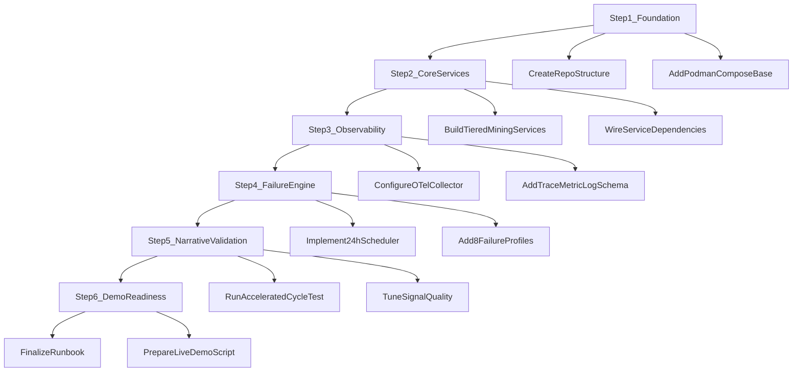
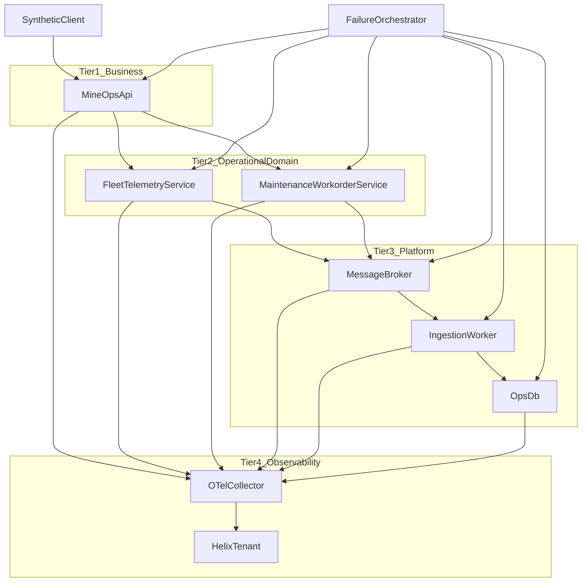
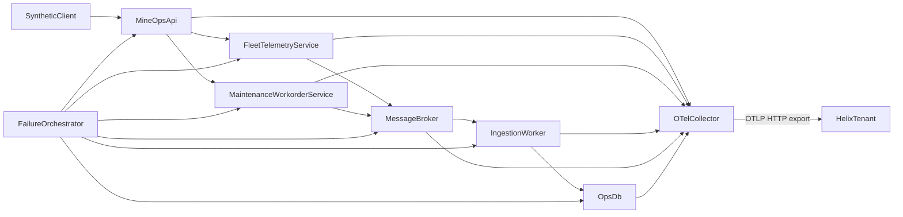

# Helix Otel - Mining Demo Plan

## Goals And Constraints
- Build a **continuous demo** that runs on Podman and emits realistic application telemetry (metrics, logs, traces) to Helix.
- Theme the workload around **mining-industry IT operations** (dispatch, telemetry ingestion, fleet tracking, maintenance systems, and plant connectivity), without naming the customer.
- Enforce a strict 24-hour behavior: **8 failure scenarios**, each running in a **3-hour slot**:
  - Hour 1: induced failure
  - Hour 2: automated recovery
  - Hour 3: stable post-recovery period
- Keep the customer anonymous in all labels, service names, dashboards, logs, and metadata.
- Use the minimum OTel Collector configuration pattern from [otel.txt](/home/rulhoa/projects/files/otel.txt).
- Align the demo narrative with capabilities emphasized in [meeting summary.txt](/home/rulhoa/projects/files/meeting summary.txt): correlation, probable root cause context, unified observability, and operational automation storyline.

## Project Steps Diagram

## Service Build Diagram

## Proposed Architecture (Podman)
- One `podman-compose` stack with:
  - `otel-collector` (receives OTLP and exports to Helix)
  - `mine-ops-api` (top-level business API for dispatch and production workflows)
  - `fleet-telemetry-service` (site operation service handling trucks, shovels, and route status)
  - `maintenance-workorder-service` (site operation service for planned/unplanned maintenance events)
  - `ingestion-worker` (platform worker for telemetry and job queues)
  - `ops-db` (platform data store for operational records)
  - `message-broker` (platform queue backbone for async operational updates)
  - `failure-orchestrator` (controls hourly scenario phase)
  - optional `synthetic-client` (generates steady traffic from mine sites and control-room requests)
- All app services instrumented with OTLP exporters to `otel-collector:4317/4318`.
- The orchestrator writes active scenario/phase to shared state so services switch behavior deterministically.

## Service Hierarchy (Realistic IT Topology)
- Define explicit dependency tiers so Helix can correlate symptoms from edge to root cause:
  - **Tier 1 - Business Services:** `mine-ops-api`
  - **Tier 2 - Operational Domain Services:** `fleet-telemetry-service`, `maintenance-workorder-service`
  - **Tier 3 - Platform Services:** `ingestion-worker`, `message-broker`, `ops-db`
  - **Tier 4 - Observability Plane:** `otel-collector` -> Helix tenant
- Correlation rule for demo narrative: incidents should surface first in Tier 1/Tier 2 symptoms and resolve to Tier 3 probable cause whenever applicable.

## 24-Hour Failure Loop Design
- Use fixed 3-hour windows and scenario index derived from UTC hour:
  - `slot = floor((currentHour % 24) / 3)` -> values `0..7`
  - `phase = currentHour % 3` -> `0=failure`, `1=recovery`, `2=stable`
- Implement one scenario per slot with realistic cross-signal evidence:
  1. `ops-db` connection pool exhaustion impacting `fleet-telemetry-service` and `mine-ops-api`
  2. Slow haul-tracking dependency in `fleet-telemetry-service` causing timeout cascade to `mine-ops-api`
  3. `message-broker` backlog spike from site telemetry bursts delaying `ingestion-worker`
  4. Memory pressure in `maintenance-workorder-service` causing degraded API responses upstream
  5. CPU saturation in `ingestion-worker` from shift-report aggregation batch window
  6. TLS/auth token expiry for external maintenance connector in `maintenance-workorder-service`
  7. Disk I/O throttle on `ops-db` causing write latency and queue growth
  8. Intermittent DNS resolution failure for remote site endpoint affecting Tier 2 services
- Recovery phase applies explicit remediation action (config toggle, restart component, clear backlog, refresh token, etc.) and emits remediation logs/events.
- Stable phase keeps SLO-compliant behavior and lower alert noise, enabling clear before/after comparison.

## Error Demo Narratives (Walkthrough)
For every scenario, the demo flow is always:
- **Hour 1 (Failure):** inject fault and let business symptoms propagate to upstream services.
- **Hour 2 (Recovery):** apply automated remediation via `failure-orchestrator`.
- **Hour 3 (Stable):** maintain healthy baseline to prove sustained recovery.

### Scenario 1: DB Connection Pool Exhaustion
- **Business context:** dispatch screens become slow and haul updates fail intermittently.
- **Failure behavior:** `ops-db` pool limit is reduced; `fleet-telemetry-service` queues DB calls; `mine-ops-api` starts returning elevated 5xx.
- **Recovery behavior:** orchestrator restores pool settings and drains queued work.
- **Stable evidence:** p95 latency and error rate normalize; queue depth remains flat.
- **Signals to highlight:** DB wait metrics spike, timeout traces at DB spans, logs with `probable_cause=db_pool_exhaustion`.

### Scenario 2: Slow Haul-Tracking Dependency Timeout Cascade
- **Business context:** truck position and ETA data lags in control-room dashboards.
- **Failure behavior:** artificial delay added to haul-tracking path in `fleet-telemetry-service`; upstream `mine-ops-api` timeouts increase.
- **Recovery behavior:** delay injection disabled; request concurrency returns to normal.
- **Stable evidence:** dependency latency drops under threshold and timeout count returns to baseline.
- **Signals to highlight:** dependency span duration inflation, timeout error logs, service latency SLO breach and recovery.

### Scenario 3: Message Broker Backlog Spike
- **Business context:** telemetry events arrive late, creating stale operational views.
- **Failure behavior:** publish rate increased while consumer rate throttled, producing backlog in `message-broker`.
- **Recovery behavior:** orchestrator scales consumer throughput and clears backlog.
- **Stable evidence:** lag trends to zero and remains near steady-state baseline.
- **Signals to highlight:** queue depth metrics, consumer lag traces, logs with `action_taken=consumer_scale_up`.

### Scenario 4: Maintenance Service Memory Pressure
- **Business context:** maintenance work-order APIs degrade during shift transition.
- **Failure behavior:** memory leak mode enabled in `maintenance-workorder-service`; GC pressure and response latency rise.
- **Recovery behavior:** remediation triggers process recycle and leak flag off.
- **Stable evidence:** RSS memory and GC pause metrics settle; error bursts stop.
- **Signals to highlight:** memory utilization metrics, slow endpoint traces, logs with `probable_cause=memory_pressure`.

### Scenario 5: Ingestion Worker CPU Saturation
- **Business context:** production KPI aggregation jobs miss expected freshness windows.
- **Failure behavior:** expensive batch aggregation path enabled in `ingestion-worker`, saturating CPU.
- **Recovery behavior:** orchestrator switches to optimized aggregation mode and reduces batch width.
- **Stable evidence:** CPU usage returns to expected band and processing throughput recovers.
- **Signals to highlight:** CPU metrics, long-running worker spans, logs with `action_taken=aggregation_mode_optimized`.

### Scenario 6: External Maintenance Connector Token Expiry
- **Business context:** sync with external maintenance records fails and tickets stop updating.
- **Failure behavior:** expired token injected in `maintenance-workorder-service`; auth errors cascade.
- **Recovery behavior:** automated token refresh job runs and retries failed sync tasks.
- **Stable evidence:** successful sync ratio returns to target and retry backlog drains.
- **Signals to highlight:** 401/403 dependency spans, auth failure logs, recovery logs with `action_taken=token_refresh`.

### Scenario 7: Disk I/O Throttle on Operational DB
- **Business context:** write-heavy operational updates become delayed and inconsistent.
- **Failure behavior:** I/O throttling simulated for `ops-db`; write latency increases and queue builds upstream.
- **Recovery behavior:** throttle removed and delayed write queue flushed.
- **Stable evidence:** write IOPS and commit latency stabilize; upstream queues normalize.
- **Signals to highlight:** disk latency metrics, DB write span delays, logs with `probable_cause=disk_io_throttle`.

### Scenario 8: Intermittent DNS Resolution Failure
- **Business context:** remote site integrations flap, causing intermittent data gaps.
- **Failure behavior:** DNS failures injected for Tier 2 outbound calls; partial request failures appear.
- **Recovery behavior:** resolver path restored and failed calls retried with backoff completion.
- **Stable evidence:** DNS error rate goes to zero and remote site data freshness recovers.
- **Signals to highlight:** network error traces, DNS failure log patterns, metric recovery in success-rate panels.

## Telemetry Contract Per Scenario
- **Traces:** route-level span errors, dependency spans with status codes/timeouts, recovery spans tagged `remediation=true`.
- **Metrics:** RED-style app metrics (`request_rate`, `error_rate`, `latency_p95`) plus resource/dependency metrics for each failure type.
- **Logs:** structured JSON with fields: `scenario_id`, `phase`, `service`, `symptom`, `probable_cause`, `action_taken`, `outcome`.
- Ensure all three signals share correlation dimensions (`trace_id`, `service.name`, `scenario_id`, `phase`).

## Minimal OTel Collector Setup (From Provided Baseline)
- Base collector keeps only:
  - receiver: `otlp` (grpc + http)
  - processor: `batch`
  - exporter: `otlphttp/bmchelix` with endpoint and required headers
  - pipelines: traces, metrics, logs
- Keep this as the canonical config in [otel-collector-config.yaml](/home/rulhoa/projects/helix-otel-mining/otel-collector-config.yaml), derived from [otel.txt](/home/rulhoa/projects/files/otel.txt).
- Operational hardening (still minimal): enable collector health check endpoint and container restart policy in Podman compose (no additional processors unless needed).

## Delivery Structure
- Project layout target:
  - [podman-compose.yml](/home/rulhoa/projects/helix-otel-mining/podman-compose.yml)
  - [otel-collector-config.yaml](/home/rulhoa/projects/helix-otel-mining/otel-collector-config.yaml)
  - [orchestrator/scheduler.js](/home/rulhoa/projects/helix-otel-mining/orchestrator/scheduler.js)
  - [services/mine-ops-api/](/home/rulhoa/projects/helix-otel-mining/services/mine-ops-api/)
  - [services/fleet-telemetry-service/](/home/rulhoa/projects/helix-otel-mining/services/fleet-telemetry-service/)
  - [services/maintenance-workorder-service/](/home/rulhoa/projects/helix-otel-mining/services/maintenance-workorder-service/)
  - [services/ingestion-worker/](/home/rulhoa/projects/helix-otel-mining/services/ingestion-worker/)
  - [services/message-broker/](/home/rulhoa/projects/helix-otel-mining/services/message-broker/)
  - [profiles/failures.yaml](/home/rulhoa/projects/helix-otel-mining/profiles/failures.yaml)
  - [profiles/service-map.yaml](/home/rulhoa/projects/helix-otel-mining/profiles/service-map.yaml)
  - [runbooks/demo-narrative.md](/home/rulhoa/projects/helix-otel-mining/runbooks/demo-narrative.md)
- `failures.yaml` defines scenario symptoms, trigger conditions, injected parameters, and recovery actions so behavior is data-driven.

## Validation And Demo Readiness
- Validate telemetry ingestion end-to-end by checking that each signal type appears per service and per scenario.
- Validate cycle correctness over accelerated test mode (e.g., 3 minutes per “hour”) before switching to real-time schedule.
- Build a demo script showing for each scenario:
  - symptom detection
  - cross-signal evidence
  - probable cause storyline
  - automatic remediation
  - stable aftermath
- Add anonymity guardrail: static lint/check to fail if restricted customer names appear in code/config/log templates.

## Risks And Mitigations
- Signal mismatch between logs/metrics/traces -> enforce shared scenario schema and integration tests.
- Noisy or unrealistic failures -> cap injection intensity and include cooldown in stable phase.
- Export interruptions to Helix -> keep queue enabled (already in baseline), add container restart policies and collector health checks.
- Secret exposure risk from config -> move API key to environment variable/secret at deploy time and rotate if previously shared in plaintext.

## Short Live Presentation Script
Use this as a fast talk track during the demo. Keep each scenario to 30-45 seconds.

### Opening (30 seconds)
- "This is **Helix Otel - Mining**, a live mining IT operations simulation with tiered services and full OpenTelemetry signals."
- "Every 3-hour slot has one pattern: **failure**, then **automatic recovery**, then a **stable window**."
- "For each incident, we focus on three things: **root cause**, **why it happened**, and **customer-facing symptoms**."

### Scenario 1: DB Pool Exhaustion
- **Root cause:** `ops-db` connection pool saturation.
- **Why:** sudden dispatch write burst consumes all DB connections.
- **Symptoms:** API latency spikes, intermittent 5xx, delayed fleet updates.

### Scenario 2: Slow Haul Tracking Dependency
- **Root cause:** downstream haul-tracking calls become slow.
- **Why:** dependency latency injection causes timeout cascade.
- **Symptoms:** ETA/position data lags, timeout errors at business API.

### Scenario 3: Message Broker Backlog
- **Root cause:** queue backlog in `message-broker`.
- **Why:** telemetry producers outpace consumers.
- **Symptoms:** stale dashboards, delayed ingestion, increasing queue lag.

### Scenario 4: Maintenance Service Memory Pressure
- **Root cause:** memory pressure in `maintenance-workorder-service`.
- **Why:** leak mode increases heap and GC overhead.
- **Symptoms:** slow maintenance endpoints, sporadic 5xx, rising response times.

### Scenario 5: Worker CPU Saturation
- **Root cause:** CPU saturation in `ingestion-worker`.
- **Why:** expensive aggregation path during shift reporting.
- **Symptoms:** KPI refresh delay, long-running jobs, processing backlog growth.

### Scenario 6: External Connector Token Expiry
- **Root cause:** expired auth token for maintenance connector.
- **Why:** connector credentials intentionally age out.
- **Symptoms:** sync failures, auth errors, work-order status not updating.

### Scenario 7: DB Disk I/O Throttle
- **Root cause:** disk I/O bottleneck on `ops-db`.
- **Why:** throttled storage path slows commit operations.
- **Symptoms:** write latency spikes, upstream queue growth, inconsistent update freshness.

### Scenario 8: DNS Intermittency
- **Root cause:** intermittent DNS resolution failures.
- **Why:** remote site endpoint resolution flaps.
- **Symptoms:** partial request failures, remote site data gaps, unstable success rate.

### Closing (20 seconds)
- "In every case, Helix correlates **metrics, logs, and traces** into one incident story."
- "The key value is faster triage: symptom at business tier, probable cause at platform tier, and verified automatic recovery."
